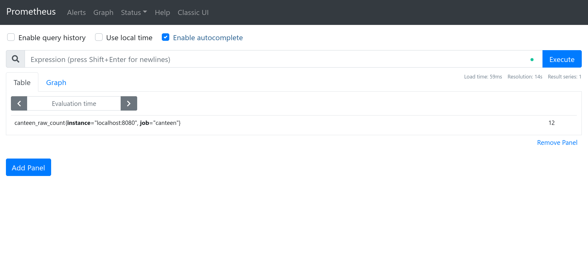

```
typora-root-url: /home/lyc/Documents/LocalDev/cs6131-research-task/
```

# TSDB Demo

In this brief demo, we will be setting up a [Prometheus](https://github.com/prometheus/prometheus) instance and collecting data from a sample prometheus exporter. You can follow this writeup or clone the repository for the ready-to-run code.

*Warning: This has been written on Linux. Most things should hopefully be similar, but there might be slight differences.*

## Setting up Prometheus

You will need [Docker](https://www.docker.com/) to follow this tutorial. (Alternatively, you may follow the instructions in the prometheus documentation to build from source, but for the sake of simplicity, we will use the docker container).

### Pull the docker container

```sh
docker run --rm -it -p 9090:9090 prom/prometheus
```

Execute the above command to start your first instance of prometheus. You will be able to access the server at `localhost:9090` (in your browser). Click on 'Graph' and you should see something like this. Congrats if you made it here!


### Configuring prometheus

Now, let's try setting up a few **targets** for prometheus to scrape data from (note: the default configuration already includes an endpoint, but we will explain it using this configuration file for simplicity)

Paste the following code into `prometheus.yml`:

```yaml
global:
  scrape_interval: 15s # By default, scrape targets every 15 seconds.

  # Attach these labels to any time series or alerts when communicating with
  # external systems (federation, remote storage, Alertmanager).
  external_labels:
    monitor: 'codelab-monitor'

# A scrape configuration containing exactly one endpoint to scrape:
# Here it's Prometheus itself.
scrape_configs:
  # The job name is added as a label `job=<job_name>` to any timeseries scraped from this config.
  - job_name: 'prometheus'

    # Override the global default and scrape targets from this job every 5 seconds.
    scrape_interval: 5s

    static_configs:
      - targets: ['localhost:9090']

  - job_name: 'canteen'

    # Override the global default and scrape targets from this job every 5 seconds.
    scrape_interval: 5s

    metrics_path: 'queueData'

    static_configs:
      - targets: ['localhost:8080']
```

Now, you will need to restart the prometheus instance. Execute the following command:

Windows:
(todo add command)

macOS:
```docker run \
    -p 9090:9090 \
    -v $(pwd)/prometheus.yml:/etc/prometheus/prometheus.yml:Z \
    prom/prometheus
```

Linux:
```sh
docker run \
    -p 9090:9090 \
    --add-host=host.docker.internal:172.17.0.1
    -v ./prometheus.yml:/etc/prometheus/prometheus.yml:Z \
    prom/prometheus
```

(Note: you should not be using this in production due to how network and files are being passed through)

Navigate to Status > Targets. You should see the following:


Note that `canteen` is currently down, but that is expected as we do not have any server serving the data yet. We will fix it in the next part.

## Preparing a Prometheus Exporter

*(Note: Refer to the [official docs](https://prometheus.io/docs/instrumenting/writing_exporters/#writing-exporters) for a detailed explanation)*

In this part, we will be setting up a very simple prometheus exporter. A prometheus exporter will serve the data in a format that prometheus can collect and store. Paste the code below into `server.py`

```python
from http.server import BaseHTTPRequestHandler, HTTPServer
import time
import requests

hostName = "localhost"
serverPort = 8080

class MyServer(BaseHTTPRequestHandler):
    def do_GET(self):
        self.send_response(200)
        self.send_header("Content-type", "text/plain")
        self.end_headers()
        if self.path == '/queueData':
            start = time.time()
            try:
                data = requests.get('https://canteen.nush.app/queueData').json()
                end = time.time()
                self.wfile.write(bytes(f'canteen_raw_count {data["raw_count"]}\n', 'utf-8'))
                self.wfile.write(bytes(f'canteen_sensor_time {data["time"]}\n', 'utf-8'))
                self.wfile.write(bytes(f'canteen_query_time {end-start}\n', 'utf-8'))
            except Exception as e:
                print(e)
        else:
            self.wfile.write(bytes(f'invalid endpoint', 'utf-8'))

if __name__ == "__main__":        
    webServer = HTTPServer((hostName, serverPort), MyServer)
    print("Server started http://%s:%s" % (hostName, serverPort))

    try:
        webServer.serve_forever()
    except KeyboardInterrupt:
        pass

    webServer.server_close()
    print("Server stopped.")

```

(Note: as this is a quick demo, proper error handling is not included. Fix the code as an optional exercise!)

Note the data that is being written to the response. This server in essence acts as a data transforming proxy for the `canteen.nush.app` api which returns data in JSON. For example,

```json
{"data_count": 0, "raw_count": 11, "time": 1616298066.3377893}
```

is transformed into

```
canteen_raw_count 11
canteen_sensor_time 1616298066.3377893
canteen_query_time 0.06025552749633789
```

where query time is the time the proxy server took to retrieve the data. Note that `data_count` is dropped since it is irrelevant to our use case.

(Note: if we have control of the API, we shouldn't introduce the additional overhead of using a proxy. But it is alright for this demo)

Start the server with `python ./server.py`. Reload the prometheus targets page, and now you should see


## Querying!

Navigate to Graph. In the default panel, enter `canteen_raw_count` and click "Execute". You should see the current data point:

If you want to query over a range, you can do the following to get data points over the past hour:


However, data in table form may not be very useful in this case. Fortunately, we can apply aggregate functions as well:


Furthermore, prometheus allows us to visualise data as well! Navigate to the Graph and execute `canteen_raw_count`. You can see something like this:


Note that the amount of data will depend on how long your instance has been running (you can read more about persistence and storage in the official documentation). You can adjust the time interval using the toggles above the graph display to fit your data more nicely.

## Conclusion

Of course, we have barely scratched the surface in this quick demo. As an optional challenge, try scraping data from [aqicn.org](http://aqicn.org/)! (You will need to request an API token, but it is free and you only need to sign up using your email). A starter skeleton code is provided in `./scrape.py`.
